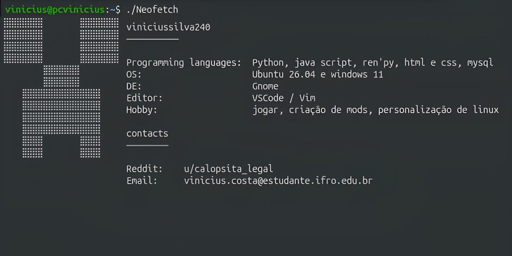

 

<h3>Linguagens</h3>

<table>
  <thead>
    <tr>
      <th>Linguagem</th>
      <th>Proficiência</th>
    </tr>
  </thead>

  <tbody>
    <tr>
      <td>Python</td>
      <td>Proficient</td>
    </tr>
    <tr>
      <td>Ren'Py</td>
      <td>Proficient</td>
    </tr>
    <tr>
      <td>JavaScript/TypeScript</td>
      <td>Proficient</td>
    </tr>
    <tr>
      <td>ProtoBuf</td>
      <td>Proficient</td>
    </tr>
    <tr>
      <td>HTML/CSS</td>
      <td>Intermediate</td>
    </tr>
  </tbody>
</table>

 
