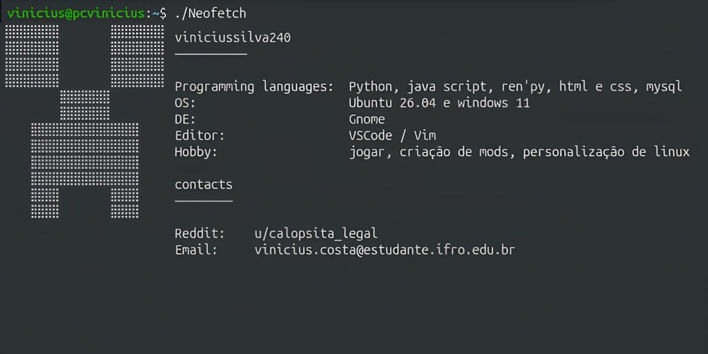

  

 

<h1>Olá, eu sou Vinicius Silva Martins Costa </h1>

<h3>Full-Stack .NET Developer</h3>

 

  

  <h3> Languages & Tools</h3>

 

    
    
    
    
    
    
    
    
  

  

    
    
    
    
    
    
    
  

  

    
    
    
    
    
    
    
    
  

 

 

---

## Contribution Snake

  

